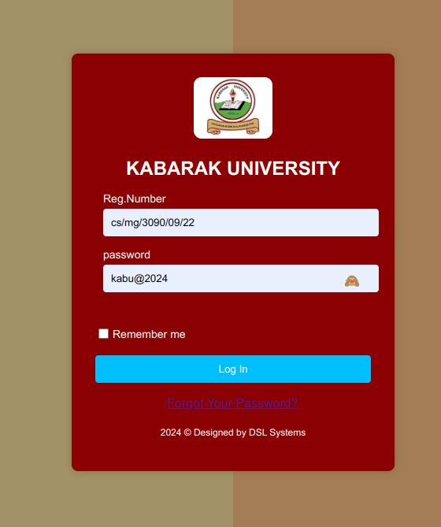
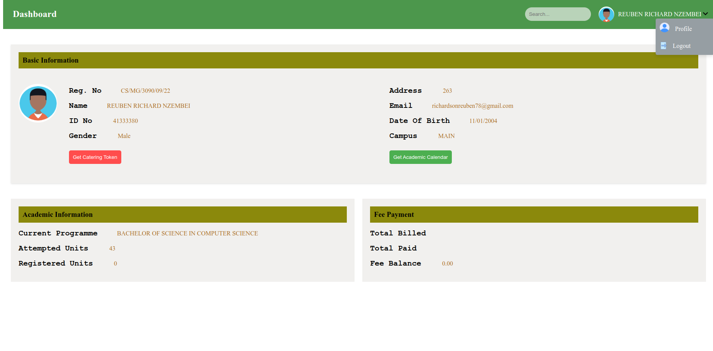

# KABARAK portal makeover
using vue js to integrate the kabarak university portal

# Testing
use this user data to test login 
 <u>**student 1**</u>  
(regNo:)cs/mg/3090/09/22 
(password:)kabu@2024 
  <u>**student 2**</u>  
(regNo:):CLM/M/0794/09/23 
(password:)kabu@2024 

# Link
Visit:[Kabu Portal](https://student-portal-66qh.onrender.com/)

# Login Screenshot

# Dashboard Screenshot

# Key concepts
1.vue routing ,,to handle navigation between views
2.user validation,,using if statement
3.form submision,,using @submit="login" event handling
4.input data binding,,v-modeling users input data