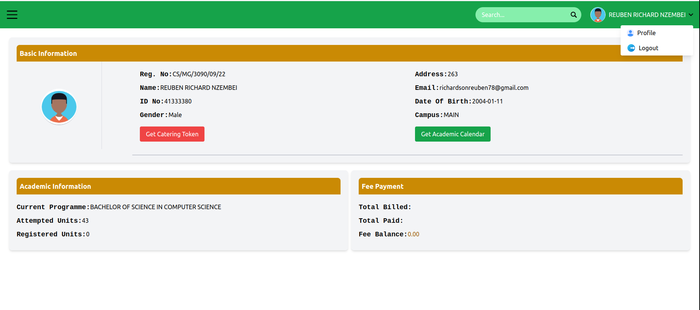

# KABARAK portal makeover
using vue js to integrate the kabarak university portal

# Testing
use this user data to test login 
 **<u>student 1</u>**  
RegNo: cs/mg/3090/09/22 
password: kabu@2024 
  **<u>student 2</u>** 
RegNo::CLM/M/0794/09/23 
password:kabu@2024 

# Link
Visit:[Kabu Portal](https://student-portal-66qh.onrender.com/)

# Login Screenshot

# Dashboard Screenshot

# Key concepts
1.vue routing ,,to handle navigation between views 
2.user validation,,using if statement 
3.form submision,,using @submit="login" event handling 
4.input data binding,,v-modeling users input data 
5.component based dashboard 
   **1.nav component** 
   **2.academic info component** 
   **3.basic info component** 
   **4.fee info component** 
6.views 
  **1.Login** 
  **2.Dashboard** 
7.students details ,,using JSON file 
8.fetching data using **Fetch API**   
9.student data storage using **local storage** 

   